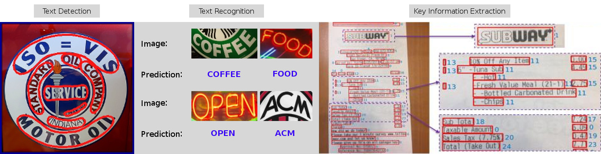

<div align="center">
  
  <div>&nbsp;</div>
  <div align="center">
    <b><font size="5">OpenMMLab website</font></b>
    <sup>
      <a href="https://openmmlab.com">
        <i><font size="4">HOT</font></i>
      </a>
    </sup>
    &nbsp;&nbsp;&nbsp;&nbsp;
    <b><font size="5">OpenMMLab platform</font></b>
    <sup>
      <a href="https://platform.openmmlab.com">
        <i><font size="4">TRY IT OUT</font></i>
      </a>
    </sup>
  </div>
  <div>&nbsp;</div>

[](https://github.com/open-mmlab/mmocr/actions)
[](https://mmocr.readthedocs.io/en/latest/?badge=latest)
[](https://codecov.io/gh/open-mmlab/mmocr)
[](https://github.com/open-mmlab/mmocr/blob/main/LICENSE)
[](https://pypi.org/project/mmocr/)
[](https://github.com/open-mmlab/mmocr/issues)
[](https://github.com/open-mmlab/mmocr/issues)

[📘Documentation](https://mmocr.readthedocs.io/) |
[🛠️Installation](https://mmocr.readthedocs.io/en/latest/install.html) |
[👀Model Zoo](https://mmocr.readthedocs.io/en/latest/modelzoo.html) |
[🆕Update News](https://mmocr.readthedocs.io/en/latest/changelog.html) |
[🤔Reporting Issues](https://github.com/open-mmlab/mmocr/issues/new/choose)

</div>

<div align="center">

English | [简体中文](README_zh-CN.md)

</div>

## Introduction

MMOCR is an open-source toolbox based on PyTorch and mmdetection for text detection, text recognition, and the corresponding downstream tasks including key information extraction. It is part of the [OpenMMLab](https://openmmlab.com/) project.

The main branch works with **PyTorch 1.6+**.

<div align="center">
  
</div>

### Major Features

- **Comprehensive Pipeline**

  The toolbox supports not only text detection and text recognition, but also their downstream tasks such as key information extraction.

- **Multiple Models**

  The toolbox supports a wide variety of state-of-the-art models for text detection, text recognition and key information extraction.

- **Modular Design**

  The modular design of MMOCR enables users to define their own optimizers, data preprocessors, and model components such as backbones, necks and heads as well as losses. Please refer to [Getting Started](https://mmocr.readthedocs.io/en/latest/getting_started.html) for how to construct a customized model.

- **Numerous Utilities**

  The toolbox provides a comprehensive set of utilities which can help users assess the performance of models. It includes visualizers which allow visualization of images, ground truths as well as predicted bounding boxes, and a validation tool for evaluating checkpoints during training.  It also includes data converters to demonstrate how to convert your own data to the annotation files which the toolbox supports.

## What's New

v0.6.0 was released in 2022-05-05.

1. We support [MASTER](https://arxiv.org/abs/1910.02562) and [DBNet++](https://arxiv.org/abs/2202.10304) now!
2. Three dataset converters are added: LSVT, RCTW, and HierText.
3. MMOCR now can load data from LMDB dataset. [Doc](https://mmocr.readthedocs.io/en/latest/tools.html#convert-text-recognition-dataset-to-lmdb-format)
4. We provide a script to convert .json labels obtained by **Labelme** into MMOCR-supported data format.

Read [Changelog](https://mmocr.readthedocs.io/en/latest/changelog.html) for more details!

## Installation

MMOCR depends on [PyTorch](https://pytorch.org/), [MMCV](https://github.com/open-mmlab/mmcv) and [MMDetection](https://github.com/open-mmlab/mmdetection).
Below are quick steps for installation.
Please refer to [Install Guide](https://mmocr.readthedocs.io/en/latest/install.html) for more detailed instruction.

```shell
conda create -n open-mmlab python=3.8 pytorch=1.10 cudatoolkit=11.3 torchvision -c pytorch -y
conda activate open-mmlab
pip3 install openmim
mim install mmcv-full
mim install mmdet
git clone https://github.com/open-mmlab/mmocr.git
cd mmocr
pip3 install -e .
```

## To Run the file
```
conda activate open-mmlab
python mmocr/utils/ocr.py demo/demo_text_ocr.jpg --print-result --imshow

```